# Enterprise AI Knowledge Hub with Slack Intergration and Multi LLM provider

> Enterprise-grade Retrieval-Augmented Generation (RAG) platform built using FastAPI, LangChain, Qdrant, React, Docker, and Slack Integration.

---
 Key Highlights

- 🚀 Enterprise-grade Retrieval-Augmented Generation (RAG) Platform
- 🧠 Multi-LLM Architecture (Gemini 2.0 Flash + Groq)
- 📚 LangChain-powered Retrieval Pipeline
- 🔎 Semantic Search using Qdrant Vector Database
- 📄 PDF Document Ingestion & Intelligent Chunking
- 🧩 BAAI/bge-small-en-v1.5 Embedding Model
- 💬 Enterprise Slack AI Assistant
- 📊 Interactive Analytics Dashboard
- 📈 AI Infrastructure Monitoring
- 💾 Persistent Conversation History
- ⚡ FastAPI + React + Docker Architecture
- 🏢 Department-wise Enterprise Knowledge Management

##  Overview

Enterprise AI Knowledge Hub is a production-style **Retrieval-Augmented Generation (RAG)** platform designed to enable organizations to securely query enterprise knowledge using natural language. Instead of relying solely on a Large Language Model's pre-trained knowledge, the system retrieves relevant company documents from a vector database and augments the LLM with real organizational context before generating responses.

The platform implements a complete enterprise RAG pipeline consisting of document ingestion, intelligent chunking, embedding generation, semantic vector search, context retrieval, and grounded answer generation. All enterprise documents are transformed into dense vector embeddings using **BAAI/bge-small-en-v1.5** and stored in **Qdrant Vector Database**, enabling fast and highly relevant semantic retrieval.

A major highlight of the platform is its **Multi-LLM Provider Architecture**. The backend is designed to support multiple Large Language Models through a unified interface, allowing seamless switching between **Google Gemini 2.0 Flash** and **Groq-powered models**. This architecture provides high availability, provider flexibility, lower latency, and resilience against provider-specific outages while maintaining a consistent API for the frontend.

Beyond the web application, the project also includes a fully integrated **Enterprise Slack AI Assistant**. Employees can directly interact with the organization's knowledge base from Slack by mentioning the bot in any workspace channel. The Slack application communicates with the FastAPI backend through secure webhooks, retrieves relevant enterprise documents using the RAG pipeline, and returns grounded, context-aware responses inside Slack, creating a real-world enterprise AI assistant experience.

The application features a modern React dashboard for knowledge management, AI-powered chat, analytics, infrastructure monitoring, persistent conversation history, and department-wise document organization. The backend is built with **FastAPI**, orchestrates the complete RAG workflow using **LangChain**, stores conversation history in **SQLite**, manages vector search with **Qdrant**, and runs inside a **Dockerized architecture** for consistent development and deployment.

Overall, the project demonstrates the practical implementation of modern Generative AI engineering concepts including Retrieval-Augmented Generation (RAG), semantic search, vector databases, embedding models, multi-provider LLM orchestration, enterprise document intelligence, Slack integration, REST APIs, Docker-based deployment, and production-ready full-stack AI application development.

---

#  Features

### Enterprise RAG Chat

-  Retrieval-Augmented Generation (RAG)
- Multi-turn contextual conversations
- Source-grounded responses
- Semantic document retrieval
- Conversation persistence
- Multi-LLM response generation
- Context-aware follow-up questions

---

### 📚 Knowledge Base

- Department-wise document management
- Enterprise document indexing
- PDF ingestion pipeline
- Semantic document search
- Vector embeddings

Departments include:

- HR
- Engineering
- Security
- Compliance
- Finance
- Company Policies

---

### 📈 Analytics Dashboard

Interactive analytics showing

- Total Documents
- Departments
- Vector Count
- Chunk Count
- Department Distribution
- Knowledge Base Statistics

---

###  AI Insights

Real-time infrastructure monitoring

Displays

- Active LLM Provider
- Embedding Model
- Vector Database
- Collection Name
- System Health
- Knowledge Base Status

---

###   Multi-LLM Configuration

- Google Gemini 2.0 Flash
- Groq LLM Integration
- Active Provider Monitoring
- Embedding Model Configuration
- Qdrant Collection Management
- AI Infrastructure Status

---

### 💬 Enterprise Slack AI Assistant

- Enterprise Slack Bot integration
- Slack Events API
- Mention-based conversations
- Secure webhook communication
- Real-time enterprise document retrieval
- RAG-powered responses directly inside Slack
- Context-aware AI assistant for employees
- ngrok support during local development

---

# 🏗 Architecture

```
                Company PDFs
                       │
               Document Loader
                       │
               Text Chunking
                       │
            BAAI/bge-small-en-v1.5
                 Embeddings
                       │
                  Qdrant Vector DB
                       │
               LangChain Retriever
                       │
              Gemini / Groq LLM
                       │
                 FastAPI Backend
              ┌──────────┴──────────┐
              │                     │
        React Dashboard        Slack Bot
```

---

# 🧠 Tech Stack

## Frontend

- React
- Vite
- CSS3
- Axios
- React Router

---

## Backend

- FastAPI
- Python
- LangChain
- Qdrant Client
- Sentence Transformers

---

## AI

- Gemini 2.0 Flash
- Groq
- Retrieval-Augmented Generation (RAG)
- Semantic Search
- Vector Embeddings

---

## Database

- SQLite
- Qdrant Vector Database

---

## DevOps

- Docker
- Docker Compose
- ngrok
- Git
- GitHub

---

## Integrations

- Slack Events API
- Slack Bot
- REST APIs

---

# 🔄 RAG Pipeline

```
PDF Documents
      │
      ▼
Document Loader
      │
      ▼
Text Chunking
      │
      ▼
Embedding Generation
      │
      ▼
Qdrant Vector Storage
      │
      ▼
Semantic Retrieval
      │
      ▼
Context Injection
      │
      ▼
Gemini / Groq
      │
      ▼
Grounded Answer
```

---

# 📁 Project Structure

```
Enterprise-AI-Knowledge-Hub/

├── backend/
│   ├── app/
│   ├── api/
│   ├── rag/
│   ├── models/
│   ├── services/
│   ├── schemas/
│   ├── database/
│   ├── slack/
│   └── main.py
│
├── frontend/
│   ├── src/
│   │    ├── components/
│   │    ├── pages/
│   │    ├── services/
│   │    └── styles/
│
├── docs/
├── docker-compose.yml
└── README.md
```

---

# 🔍 Core Capabilities

- Retrieval-Augmented Generation
- Vector Search
- Enterprise Knowledge Base
- Persistent Chat
- Slack Assistant
- Semantic Search
- Source Citation
- Dashboard Analytics
- AI Infrastructure Monitoring
- Department-wise Knowledge Management

---

# 🖥 Screenshots

## Dashboard

>
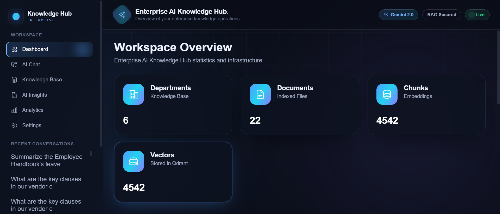
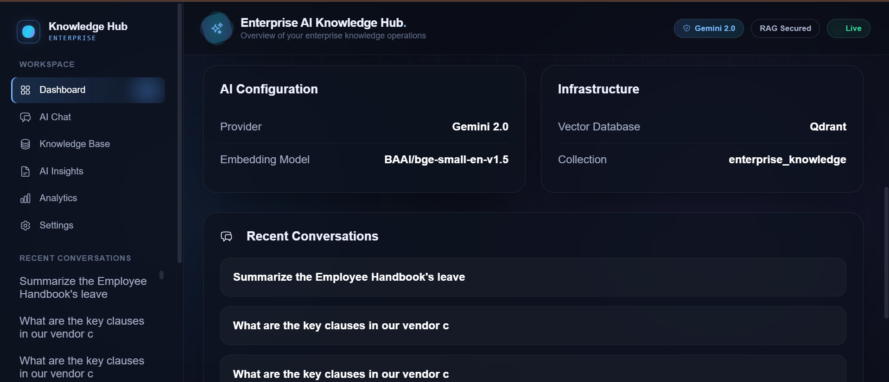
---

## AI Chat
!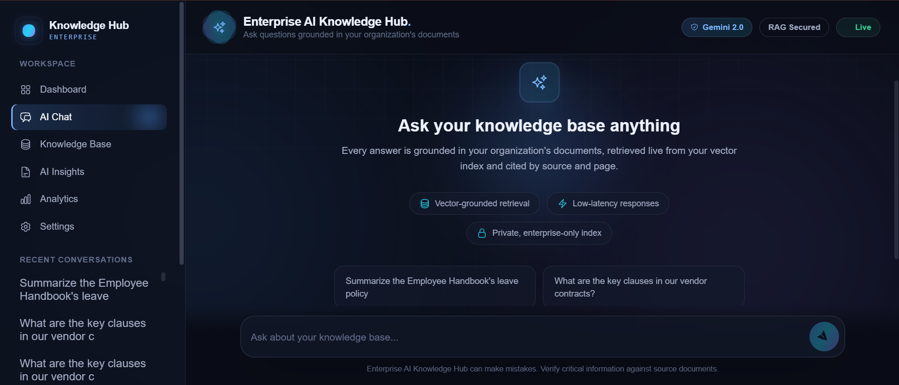


---

## Knowledge Base

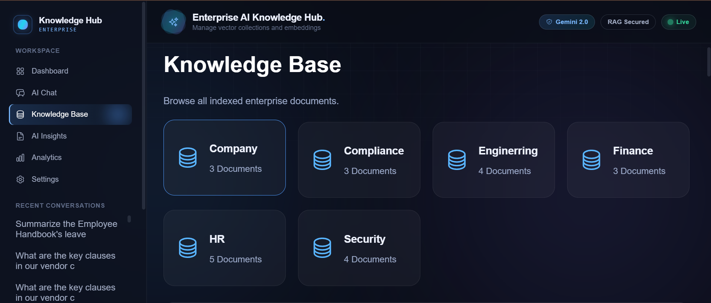
[Knowledge Base](screenshots/image4.png)


## Analytics
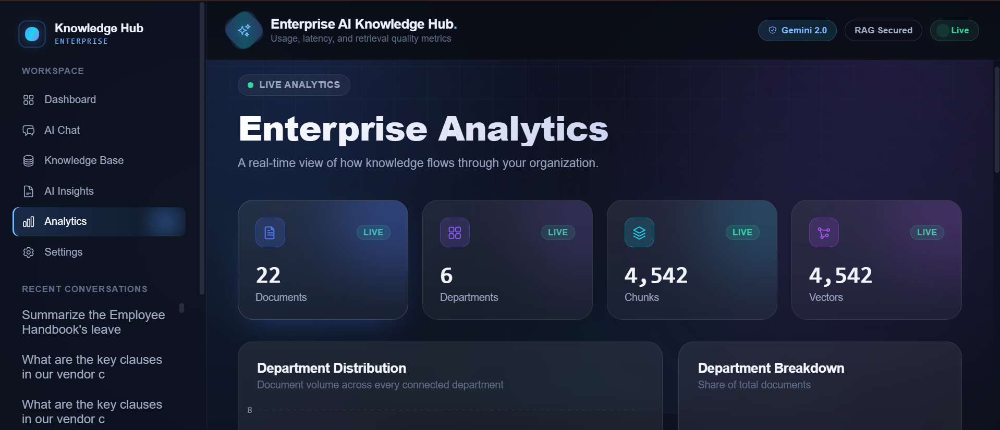
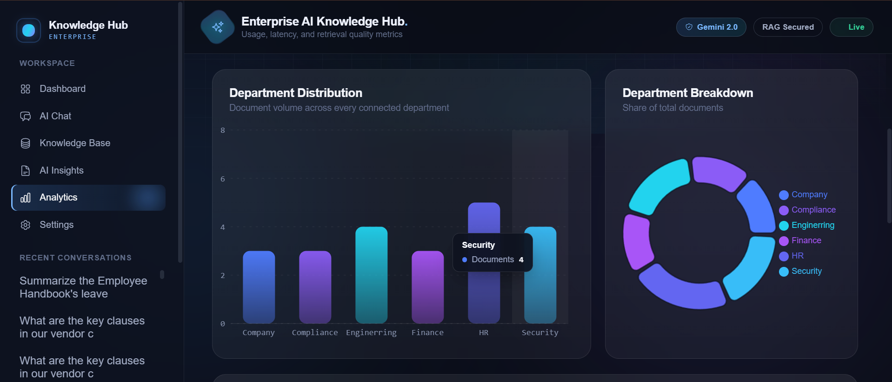
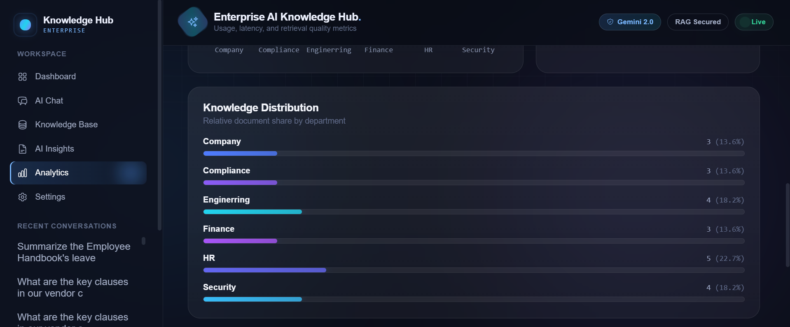
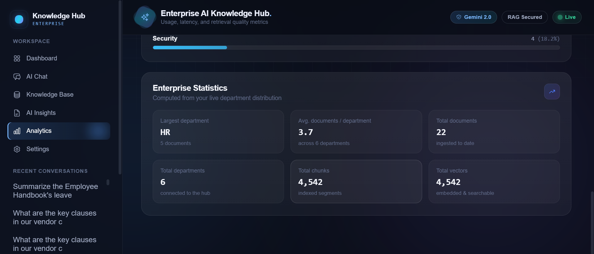


## AI Insights

> 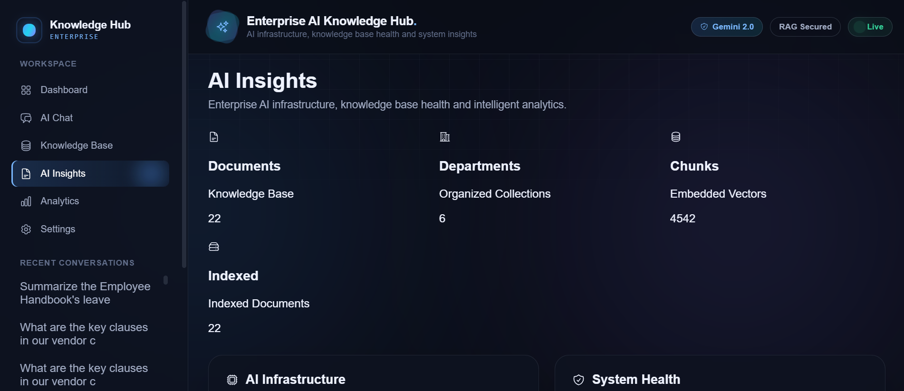
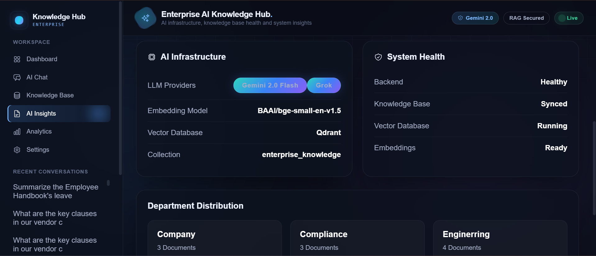
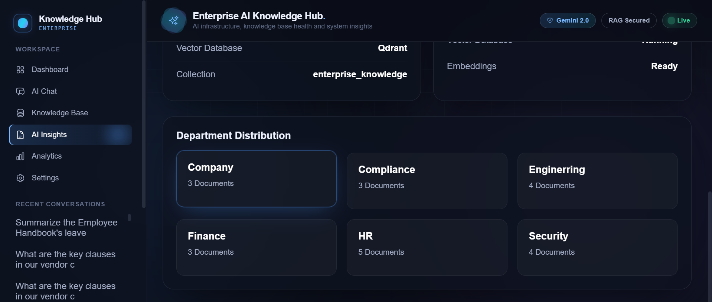
---

## Slack Bot

>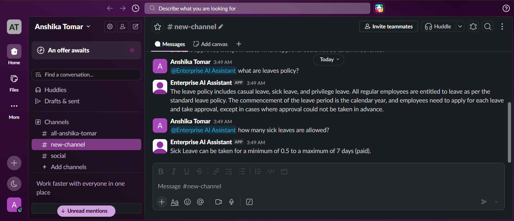

## Settings
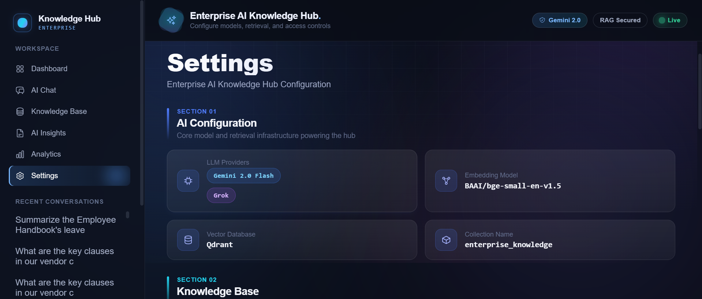
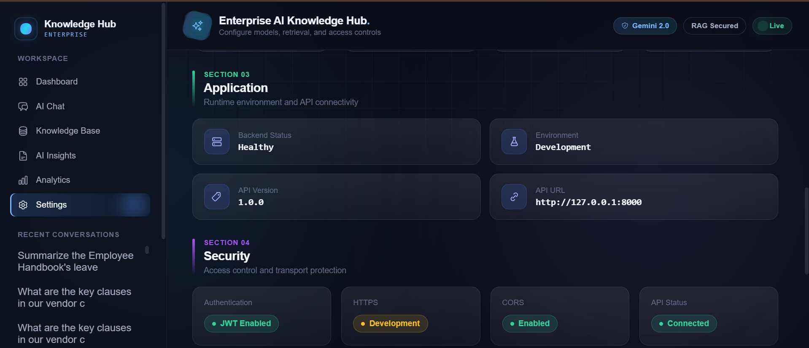
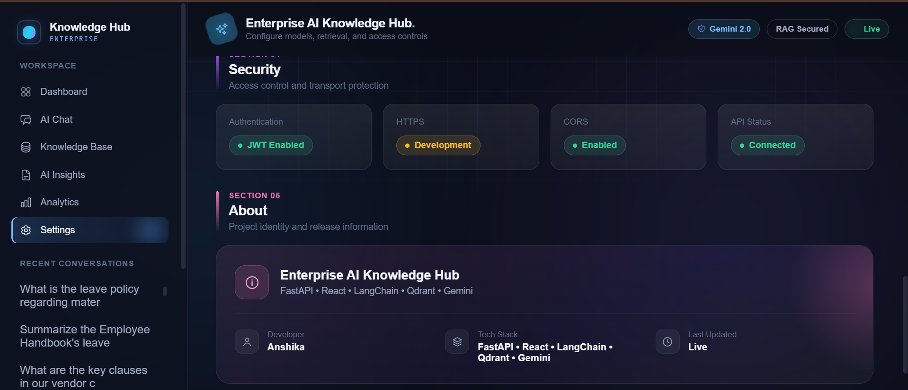

---

# 🚀 Future Improvements

- Authentication & RBAC
- Multi-user workspaces
- Streaming responses
- Hybrid Search
- Re-ranking
- OCR Pipeline
- File Upload UI
- Kubernetes Deployment

---

# 📚 Skills Demonstrated

- Retrieval-Augmented Generation (RAG)
- LangChain
- Prompt Engineering
- Vector Databases
- Semantic Search
- FastAPI
- React
- Docker
- REST APIs
- Slack API
- Enterprise AI
- Embedding Models
- Production Backend Architecture
- AI Infrastructure Monitoring

---

# 👩‍💻 Author

**Anshika Tomar**

AI/ML Engineer | Full Stack Developer | RAG & Generative AI Enthusiast

---

⭐ If you found this project interesting, consider giving it a star!